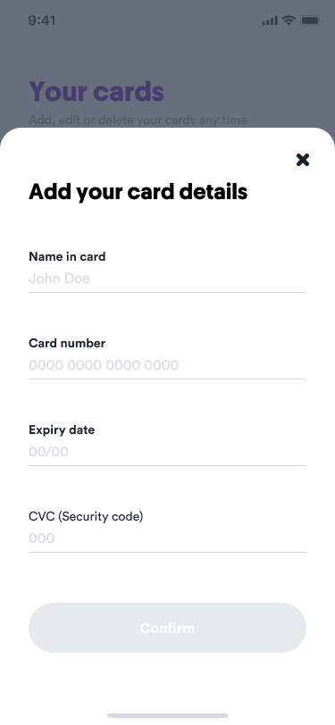

# Casumo Frontend Developer Test

Casumo allows players to register multiple register payment methods to make deposits easier.

---

## The Task

Your task is to implement a small app that helps users to add bank cards as payment methods.

The app should have three screens:

|  Screen  |                                                                        | Description              |
:--------- |:----------------------------------------------------------------------:|:------------------------- |
1          |          |  Show a list of the already registered bank cards. |
2          |    |  Show a form for registering a new credit card. This form should appear when clicking the “Add new card” button.                         |
3          |           |  Show a form for editing an existing credit card. This form should appear when clicking on an existing credit card. |

---

## Form validation

The form for registering a new bank card has to validate if the card details are correct before submitting the form, or return an error otherwise.

|  State                                                                      | Description                                                              |
:---------------------------------------------------------------------------- |:------------------------------------------------------------------------ |
  |  **Success:**   Show the successful state for the inputs according to the design. |
    |  **Error:**   Show input validation errors according to the design. |

---

## The tools
Feel free to use whichever tools you like, although for the UI part we would prefer React.

Regarding persisting the data **we advise you not to build a backend service** for it but rather keep the data on the client. 
Use whichever data-layer you are comfortable with.

---

## Design tokens

Here at Casumo we have a crack team of designers that speak their own language. We’re sharing some of that here with you in the hope that it can help you create pixel perfection.

### Spacings
- `4px`
- `8px`
- `16px`
- `24px`
- `32px`
- `40px`
- `48px`
- `56px`

### Fonts
- [Circular Pro](./resources/lineto-circular-pro-book.woff2)

### Fonts-size
- `10px`
- `14px`
- `16px`
- `24px`
- `30px`

### Border-radius
- `16px`
- `24px`
- `100px`

### Colours

| HEX | Preview |
| ------- | ------- |
| `#4C00C2` |  |
| `#32007E` |  |
| `#3B058E` |  |
| `#E5E5E5` |  |
| `#FFFFFF` |  |
| `#D3D8E1` |  |
| `#798291` |  |
| `#444E5D` |  |
| `#1A212C` |  |
| `#19AC51` |  |
| `#FC484C` |  |

---

## Notes
- Consider the code you write to be production worthy
- Make sure that you include the version-control history for the project when you are sharing it with us
- We expect you to create your own solution rather than rely on 3rd party components.
- You can find all the assets [here](./resources)
- You can find all the app screens [here](./resources/screens)
